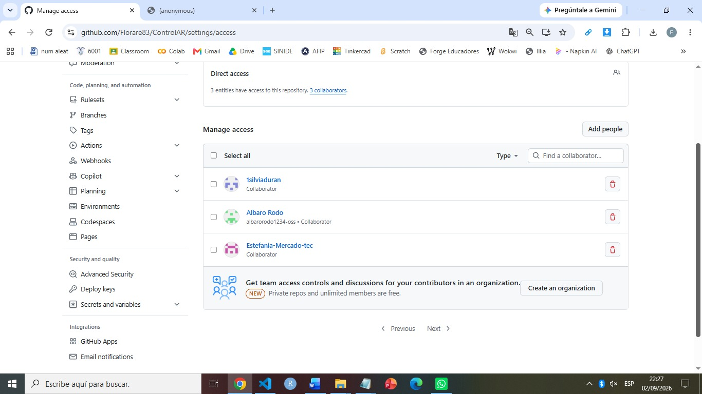
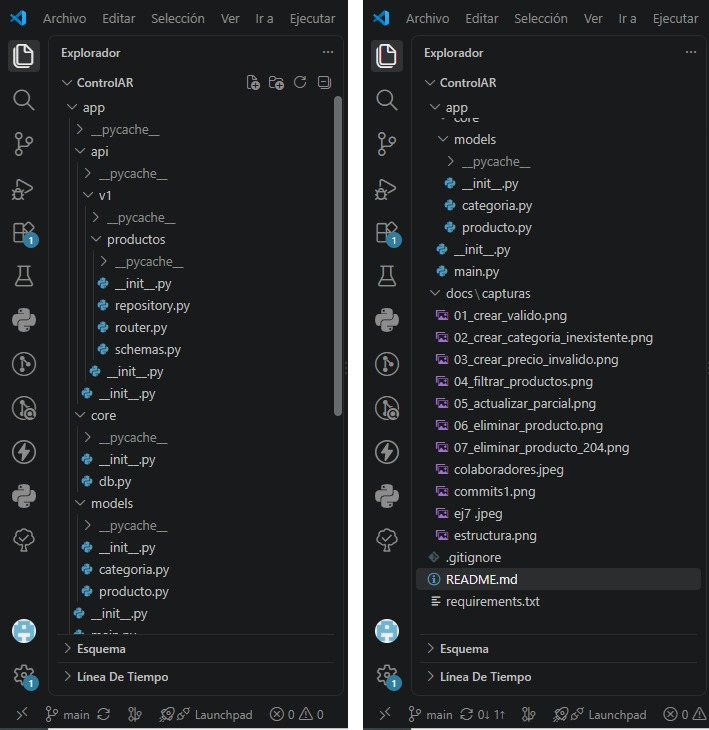
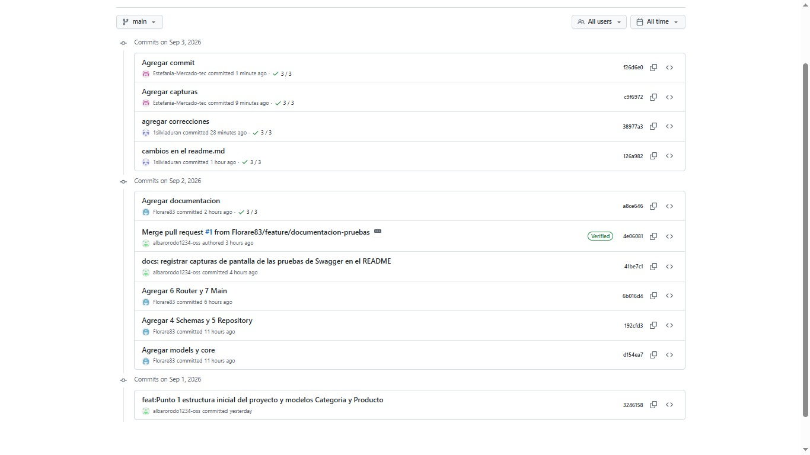

### SEMANA 0

# Nombre del Proyecto: ControlAR

## Descripción
Gestión de préstamos y venta de juegos de mesa modernos.

## Integrantes
| Nombre           | Usuario GitHub 
|------------------|----------------
| Albaro Rodo      | @albarorodo1234-oss
| Silvia Duran     | @1silviaduran 
| Estefania Mercado| @Estefania-Mercado-tec
| Lidia Areco      | @Florare83    

## Colaboradores

## Instrucciones de uso
1. Clonar el repositorio: git clone https://github.com/Florare83/ControlAR.git
2. Crear entorno virtual: python -m venv venv
3. Activar entorno virtual: venv\Scripts\activate
4. Instalar dependencias: pip install "fastapi[standard]"
5. Levantar el servidor: fastapi dev main.py

## Diagrama de estructura de carpetas

## Endpoints
| Método | Ruta           | Código de estado | Descripción           
|--------|----------------|-------------------|-----------------------
| GET    | /productos     | 200               | Lista todos los items 
| POST   | /productos     | 201               | Crea un item          
| GET    | /productos/{id}| 200 / 404         | Obtiene un item       
| PUT    | /productos/{id}| 200 / 404         | Actualiza un item     
| DELETE | /productos/{id}| 204 / 404         | Elimina un item        

## Historial de commits

## Pruebas de Funcionamiento de la API (Swagger UI)

A continuación, se documentan las pruebas de control de calidad realizadas sobre los endpoints interactivos en `/docs`.

### a) Creación de un Producto Válido (Status 201)
Al enviar un cuerpo JSON estructurado con una categoría persistente, el sistema responde satisfactoriamente registrando el nuevo producto.

### b) Validación de Categoría Inexistente (Status 400)
El endpoint de creación intercepta peticiones que intenten registrar productos bajo categorías que no existen en la simulación de la base de datos.

### c) Validación de Esquema con Pydantic (Status 422)
Pydantic valida de forma automática los tipos de datos y restricciones antes de procesar la lógica de negocio. En este caso, rechaza un precio negativo.

### d) Listado de Productos con Filtros Combinados (Status 200)
Comprobación del correcto funcionamiento de la búsqueda case-insensitive por término y filtro de categoría simultáneos.

### e) Actualización Parcial del Producto - PUT (Status 200)
Validación de la lógica `exclude_unset` en el repositorio, la cual permite cambiar únicamente el precio de un producto sin afectar al resto de atributos no enviados.

### f) Ciclo de Eliminación Completo (Status 204 y 404)
Demostración de consistencia lógica: la primera eliminación devuelve una respuesta exitosa sin contenido y los intentos posteriores son interceptados con un error de recurso no encontrado.
 

### SEMANA 1:

## ControlAR — Frontend

Frontend de ControlAR  hecho con React + Vite y React Router. Por ahora usa datos de ejemplo (src/data/juegos.js); en la Entrega 5 se va a conectar contra la API real.

### Cómo levantarlo:

Instalar las dependencias (solo la primera vez):

   npm install

Levantar el servidor de desarrollo:

   npm run dev

Abrir la URL que muestra la terminal (por defecto http://localhost:5173).

## Estructura de carpetas

src/
  components/   -> piezas reutilizables (Navbar, TarjetaJuego)

  pages/        -> una página por cada sección del sitio

  data/         -> datos de ejemplo (se reemplaza por la API luego)

  App.jsx       -> define las rutas de la app

  main.jsx      -> punto de entrada, monta todo en el HTML

  index.css     -> estilos de toda la app

## Páginas
(Ruta	y Página)
/nosotros	Quiénes somos + preguntas frecuentes

/club	Próximos eventos del club

/juegos	Catálogo con buscador, filtro y paginación

/contacto	Formulario de contacto

/login	Inicio de sesión

## Link de Figma:
https://www.figma.com/design/hQ57pUiLWMExiycWbQKpGj/ControlAR?node-id=1-2723&t=uNablvEeJrcQvXxc-1

