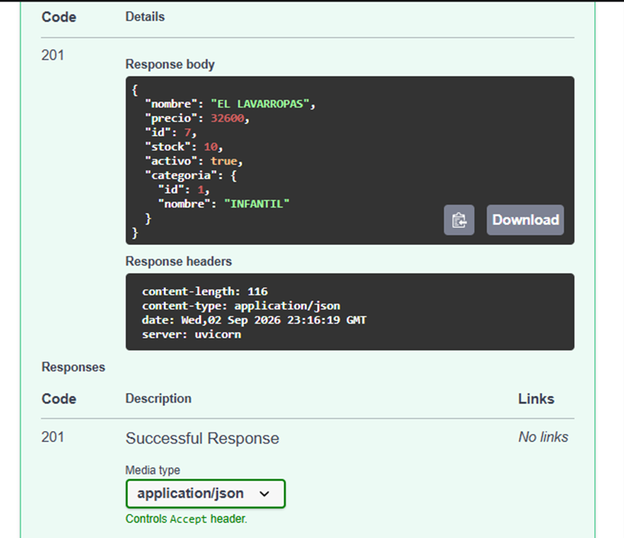
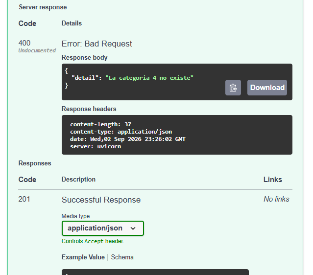
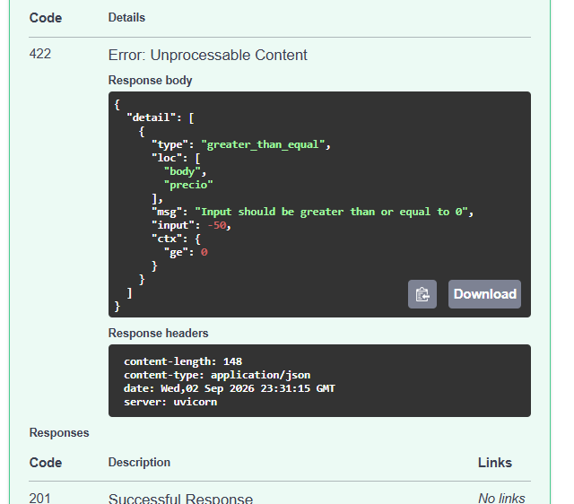
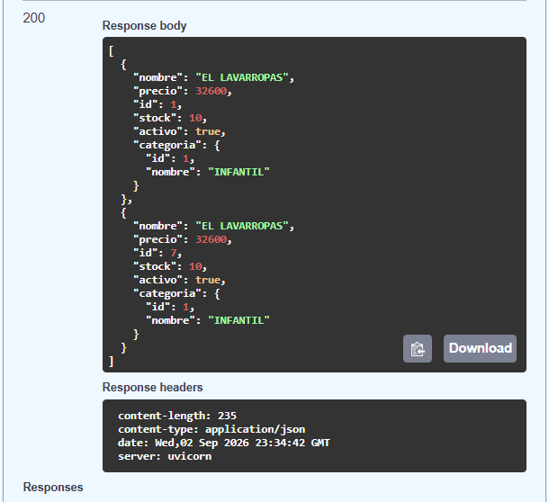
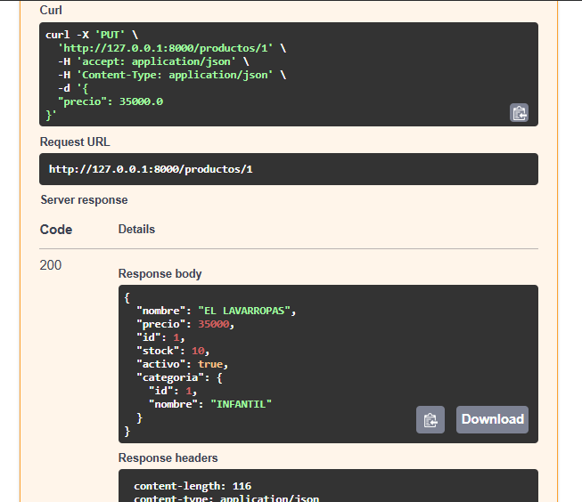
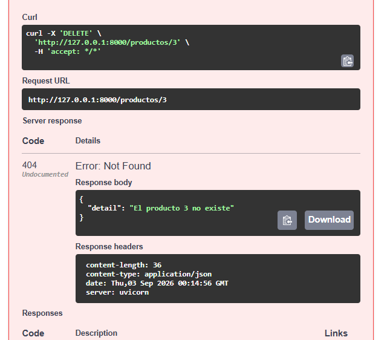

## 🧪 Pruebas de Funcionamiento de la API (Swagger UI)

A continuación, se documentan las pruebas de control de calidad realizadas sobre los endpoints interactivos en `/docs`.

### a) Creación de un Producto Válido (Status 201)
Al enviar un cuerpo JSON estructurado con una categoría persistente, el sistema responde satisfactoriamente registrando el nuevo producto.

### b) Validación de Categoría Inexistente (Status 400)
El endpoint de creación intercepta peticiones que intenten registrar productos bajo categorías que no existen en la simulación de la base de datos.

### c) Validación de Esquema con Pydantic (Status 422)
Pydantic valida de forma automática los tipos de datos y restricciones antes de procesar la lógica de negocio. En este caso, rechaza un precio negativo.

### d) Listado de Productos con Filtros Combinados (Status 200)
Comprobación del correcto funcionamiento de la búsqueda case-insensitive por término y filtro de categoría simultáneos.

### e) Actualización Parcial del Producto - PUT (Status 200)
Validación de la lógica `exclude_unset` en el repositorio, la cual permite cambiar únicamente el precio de un producto sin afectar al resto de atributos no enviados.

### f) Ciclo de Eliminación Completo (Status 204 y 404)
Demostración de consistencia lógica: la primera eliminación devuelve una respuesta exitosa sin contenido y los intentos posteriores son interceptados con un error de recurso no encontrado.
 