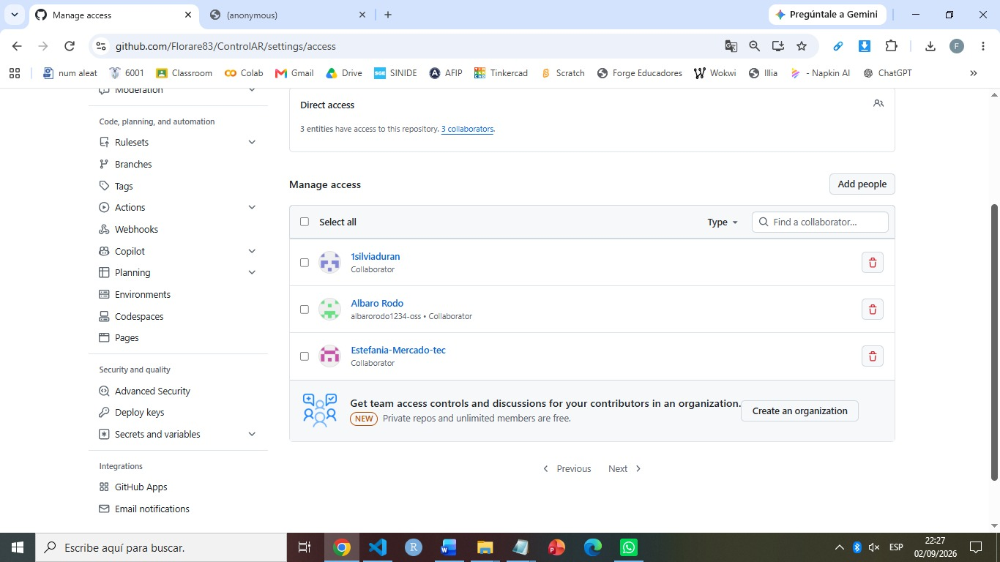
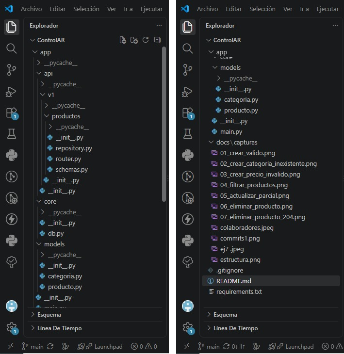
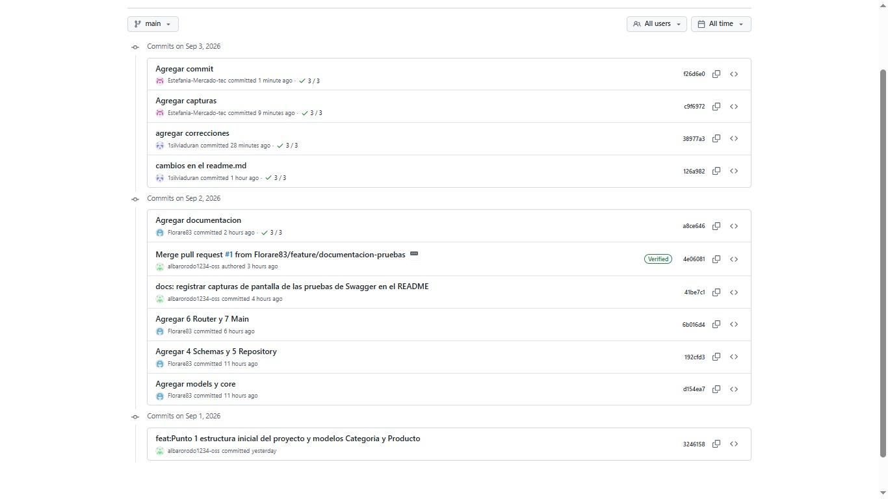
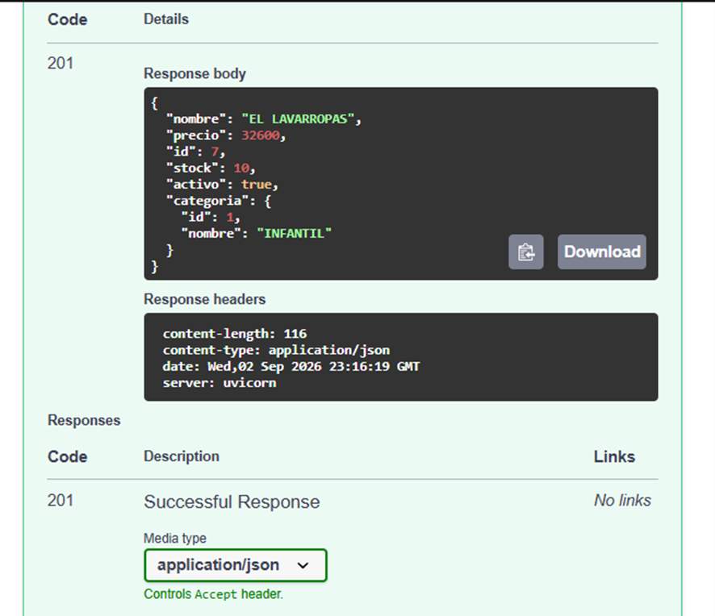
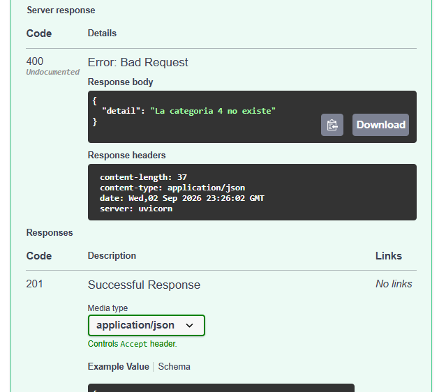
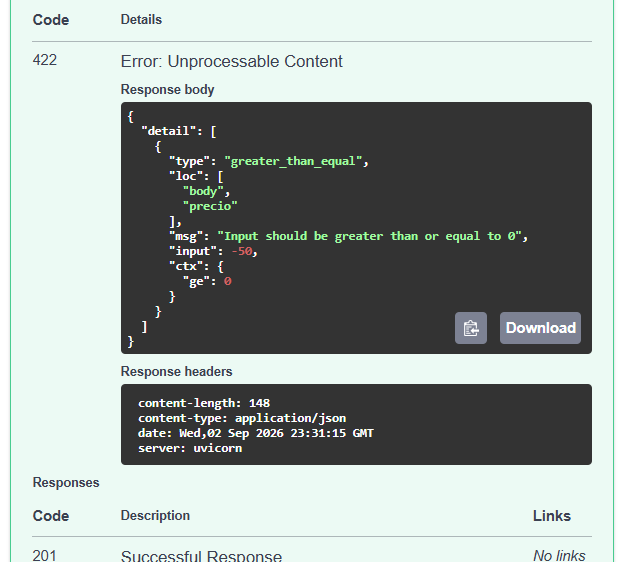
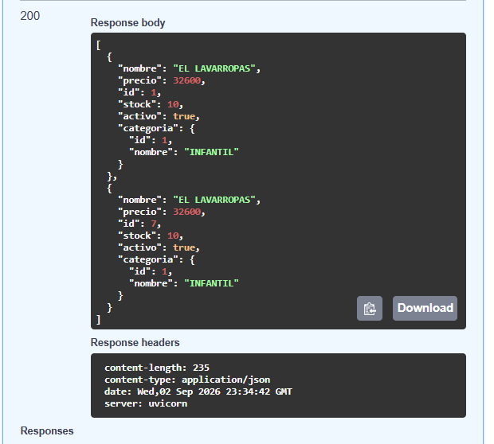
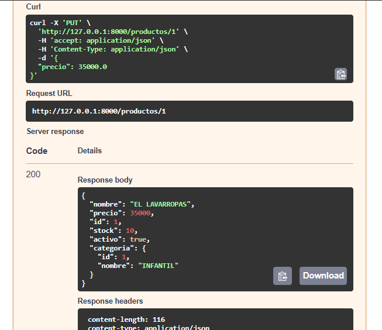
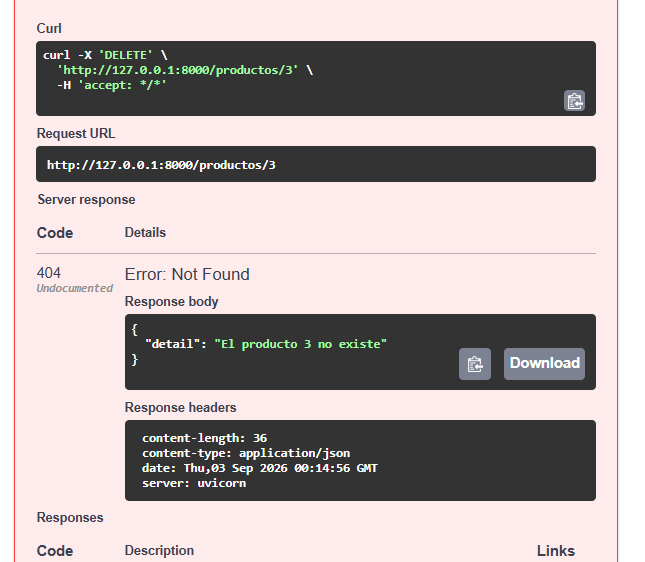

# Nombre del Proyecto: ControlAR

## Descripción
Gestión de préstamos y venta de juegos de mesa modernos.

## Integrantes
| Nombre           | Usuario GitHub 
|------------------|----------------
| Albaro Rodo      | @albarorodo1234-oss
| Silvia Duran     | @1silviaduran 
| Estefania Mercado| @Estefania-Mercado-tec
| Lidia Areco      | @Florare83    

## Colaboradores

## Instrucciones de uso (backend)
1. Clonar el repositorio: `git clone https://github.com/Florare83/ControlAR.git`
2. Crear entorno virtual: `python -m venv venv`
3. Activar entorno virtual: `venv\Scripts\activate` (Windows) o `source venv/bin/activate` (Linux/Mac)
4. Instalar dependencias: `pip install -r requirements.txt`
5. Crear el archivo `.env` a partir de `.env.example` y completar:
   - `DATABASE_URL`: URL de la base de datos PostgreSQL. En local usar la **External Database URL** de Render; dentro del servicio en Render, la **Internal Database URL**. Debe empezar con `postgresql://`.
   - `SECRET_KEY`: clave para firmar los tokens. Generarla con `python -c "import secrets; print(secrets.token_hex(32))"`.
   - `ACCESS_TOKEN_EXPIRE_MINUTES` (opcional, por defecto 60).
6. Crear las tablas y cargar las categorías:
   - `python -m app.core.crear_tablas`
   - `python -m app.core.cargar_categorias`
7. Crear el primer administrador (PowerShell):
   `$env:ADMIN_EMAIL="correo@ejemplo.com"; $env:ADMIN_PASSWORD="una-clave-larga"; python -m app.core.crear_admin`
8. Levantar el servidor: `fastapi dev app/main.py` (o `uvicorn app.main:app --reload`)
9. Documentación interactiva (Swagger): http://localhost:8000/docs

## Diagrama de estructura de carpetas

## Endpoints
### Juegos
| Método | Ruta           | Acceso  | Código de estado | Descripción |
|--------|----------------|---------|------------------|-------------|
| GET    | /juegos/       | Público | 200              | Lista los juegos (acepta `?query=` para buscar por título) |
| GET    | /juegos/{id}   | Público | 200 / 404        | Obtiene un juego |
| POST   | /juegos/       | Admin   | 201 / 400 / 401 / 403 | Crea un juego |
| PUT    | /juegos/{id}   | Admin   | 200 / 400 / 404 / 401 / 403 | Actualiza un juego (parcial) |
| DELETE | /juegos/{id}   | Admin   | 204 / 404 / 401 / 403 | Elimina un juego |
 
### Categorías
| Método | Ruta         | Acceso  | Código de estado | Descripción |
|--------|--------------|---------|------------------|-------------|
| GET    | /categorias/ | Público | 200              | Lista las categorías |
 
### Autenticación (JWT)
| Método | Ruta           | Acceso  | Código de estado | Descripción |
|--------|----------------|---------|------------------|-------------|
| POST   | /auth/register | Público | 201 / 409 / 422  | Crea un usuario común (409 si el correo ya existe) |
| POST   | /auth/login    | Público | 200 / 401        | Recibe `username` (el correo) y `password` como formulario; devuelve el token |
| GET    | /auth/me       | Usuario | 200 / 401        | Datos del usuario logueado |
 
El token se envía en el header `Authorization: Bearer <token>`. Sin token las rutas protegidas responden **401**; con un usuario que no es administrador, **403**.
 
Las contraseñas se guardan con hash (argon2), nunca en texto plano.

### Usuarios y roles
- **Usuario común**: se registra desde el sitio (`/registro`) y puede ver el catálogo.
- **Administrador**: además puede agregar, editar y eliminar juegos. Se crea (o se promueve a un usuario ya registrado) con:
  `$env:ADMIN_EMAIL="correo@ejemplo.com"; $env:ADMIN_PASSWORD="clave-de-8-o-mas"; python -m app.core.crear_admin`
  Si el usuario ya existe, el script solo le da permisos de admin y no cambia su contraseña. Después tiene que cerrar sesión y volver a entrar.

## Historial de commits

## Pruebas de Funcionamiento de la API (Swagger UI)

A continuación, se documentan las pruebas de control de calidad realizadas sobre los endpoints interactivos en `/docs`.

### a) Creación de un Producto Válido (Status 201)
Al enviar un cuerpo JSON estructurado con una categoría persistente, el sistema responde satisfactoriamente registrando el nuevo producto.

### b) Validación de Categoría Inexistente (Status 400)
El endpoint de creación intercepta peticiones que intenten registrar productos bajo categorías que no existen en la simulación de la base de datos.

### c) Validación de Esquema con Pydantic (Status 422)
Pydantic valida de forma automática los tipos de datos y restricciones antes de procesar la lógica de negocio. En este caso, rechaza un precio negativo.

### d) Listado de Productos con Filtros Combinados (Status 200)
Comprobación del correcto funcionamiento de la búsqueda case-insensitive por término y filtro de categoría simultáneos.

### e) Actualización Parcial del Producto - PUT (Status 200)
Validación de la lógica `exclude_unset` en el repositorio, la cual permite cambiar únicamente el precio de un producto sin afectar al resto de atributos no enviados.

### f) Ciclo de Eliminación Completo (Status 204 y 404)
Demostración de consistencia lógica: la primera eliminación devuelve una respuesta exitosa sin contenido y los intentos posteriores son interceptados con un error de recurso no encontrado.
 

## ControlAR — Frontend

### Cómo levantarlo:
 
Instalar las dependencias (solo la primera vez):
 
   npm install
 
Levantar el servidor de desarrollo:
 
   npm run dev
 
Abrir la URL que muestra la terminal (por defecto http://localhost:5173).
 
La URL de la API se define con `VITE_API_URL` (en desarrollo, en `.env.development`; en Render, como variable de entorno del Static Site, sin barra al final). Como Vite la incorpora al compilar, hay que volver a desplegar el Static Site si se cambia.

### Estructura de carpetas

src/
 
  api/          -> llamadas al backend (api.js) y manejo del token
 
  components/   -> piezas reutilizables (Navbar, TarjetaJuego, FormularioJuego)
 
  context/      -> AuthContext: guarda quién inició sesión y si es admin
 
  pages/        -> una página por cada sección del sitio
 
  data/         -> datos de ejemplo
 
  App.jsx       -> define las rutas de la app
 
  main.jsx      -> punto de entrada, monta todo en el HTML
 
  index.css     -> estilos de toda la app

### Páginas
| Ruta | Página |
|------|--------|
| /nosotros | Quiénes somos + preguntas frecuentes |
| /club | Próximos eventos del club |
| /juegos | Catálogo con buscador, filtro y paginación. El administrador ve además Agregar, Editar y Eliminar |
| /contacto | Formulario de contacto |
| /login | Inicio de sesión (la opción "Recordarme" guarda la sesión en el navegador) |
| /registro | Crear una cuenta nueva |

### Link de Figma:
https://www.figma.com/design/hQ57pUiLWMExiycWbQKpGj/ControlAR?node-id=1-2723&t=uNablvEeJrcQvXxc-1

### SEMANA 2: Autenticación y despliegue
 
## Despliegue en Render
- **Base de datos**: PostgreSQL de Render.
- **Backend** (Web Service):
  - Build Command: `pip install -r requirements.txt`
  - Start Command: `python -m app.core.crear_tablas && python -m app.core.cargar_categorias && uvicorn app.main:app --host 0.0.0.0 --port $PORT`
  - Variables de entorno: `DATABASE_URL` (Internal URL), `SECRET_KEY` y `CORS_ORIGINS` (URL del Static Site, sin barra al final; varias separadas por coma).
  - Documentación: https://controlarwebsservice.onrender.com/docs
- **Frontend** (Static Site):
  - Build Command: `npm install && npm run build`
  - Publish Directory: `dist`
  - Variable de entorno: `VITE_API_URL` con la URL del backend.
  - Para que las rutas como `/login` funcionen al recargar la página, agregar una regla de rewrite `/*` → `/index.html`.
El plan gratuito de Render duerme el servicio sin uso: la primera carga puede tardar hasta un minuto.
 
## Seguridad
- `.env` está en `.gitignore`: no se sube la URL de la base ni la `SECRET_KEY`.
- Los tokens vencen a los 60 minutos (configurable) y no hay refresh token: al vencer hay que volver a iniciar sesión.
 